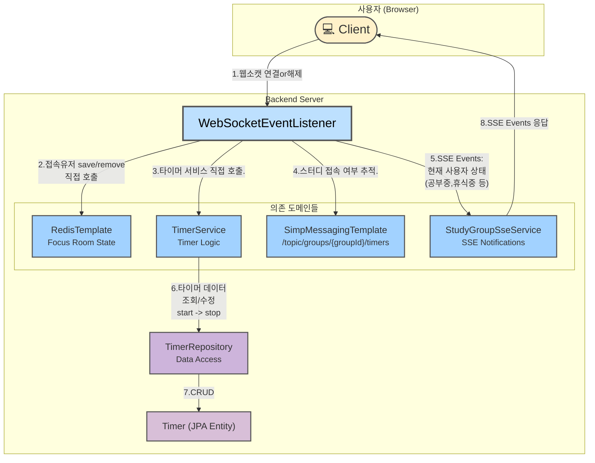

# Timer Domain Architecture (Before Refactoring)

아래 다이어그램은 리팩토링 전 타이머 도메인의 아키텍처를 보여줍니다.
`WebSocketEventListener`가 중앙에서 너무 많은 역할을 수행하며 여러 컴포넌트와 직접 상호작용하고 있음을 확인할 수 있습니다. 이로 인해 결합도가 높고 유연성이 떨어지는 구조가 되었습니다.

## 문제점

1.  **단일 책임 원칙 (SRP) 위반**: `WebSocketEventListener`는 웹소켓 생명주기 관리, Redis 세션 관리, 타이머 비즈니스 로직 호출, WebSocket 메시징, SSE 알림 전송 등 너무 많은 책임을 가지고 있습니다.
2.  **강한 결합 (High Coupling)**: `WebSocketEventListener`가 `TimerService`, `StudyGroupSseService`, `RedisTemplate` 등 구체적인 구현체에 직접 의존하여, 한 부분의 변경이 다른 부분에 영향을 미칠 가능성이 높습니다.
3.  **낮은 유연성 및 확장성**: 연결 해제 시 또 다른 동작을 추가하려면 `WebSocketEventListener` 코드를 직접 수정해야만 합니다.
4.  **테스트 어려움**: 여러 컴포넌트와 얽혀있어 단위 테스트 작성이 매우 어렵습니다.
