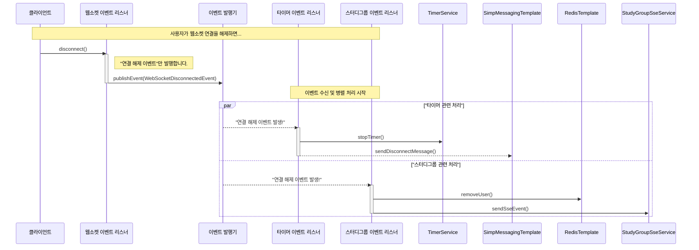

# 타이머 도메인 리팩토링: 이벤트 기반 아키텍처 도입

## 1. 현 구조의 문제점 (As-Is)

현재 `WebSocketEventListener`는 WebSocket의 연결 및 해제 이벤트를 처리하면서, 다음과 같이 너무 많은 책임을 동시에 수행하고 있습니다.

-   `TimerService`를 직접 호출하여 타이머를 제어
-   `RedisTemplate`을 직접 사용하여 세션 및 사용자 정보를 관리
-   `SimpMessagingTemplate`을 사용하여 WebSocket 메시지를 브로드캐스팅
-   `StudyGroupSseService`를 호출하여 SSE 이벤트를 전송

이는 **단일 책임 원칙(SRP)**을 위배하며, 각 도메인(타이머, 스터디그룹) 간의 **결합도(Coupling)**를 높여 코드를 복잡하게 만들고 유지보수를 어렵게 합니다.

## 2. 리팩토링 목표 (To-Be)

`WebSocketEventListener`에 집중된 책임을 분리하고, 도메인 간의 결합도를 낮추기 위해 **스프링의 내장 이벤트 메커니즘**을 활용한 이벤트 기반 아키텍처를 도입합니다.

### 기대 효과
-   **관심사 분리:** `WebSocketEventListener`는 "연결이 끊어졌다"는 사실만 알리고, 그 이후의 처리는 각자 책임이 있는 리스너들이 알아서 수행합니다.
-   **결합도 감소:** 타이머 로직을 변경해도 WebSocket이나 스터디그룹 로직에 영향을 주지 않습니다.
-   **확장성 증가:** 향후 연결 해제 시 또 다른 작업(예: 로그 기록)이 필요하면, 새로운 이벤트 리스너를 추가하기만 하면 되므로 변경에 유연합니다.

### Mermaid 다이어그램으로 보는 기대 결과

아래 다이어그램은 리팩토링 후의 이벤트 처리 흐름을 보여줍니다.

